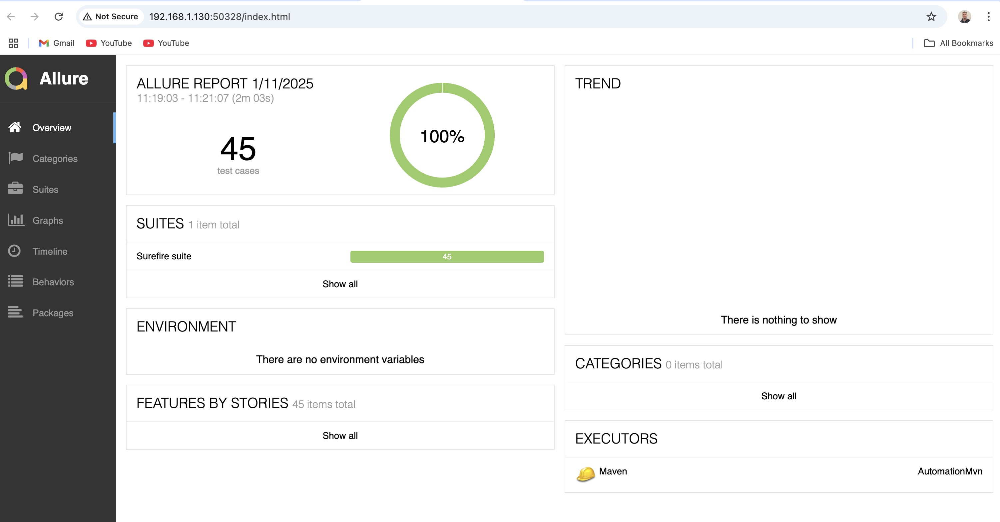
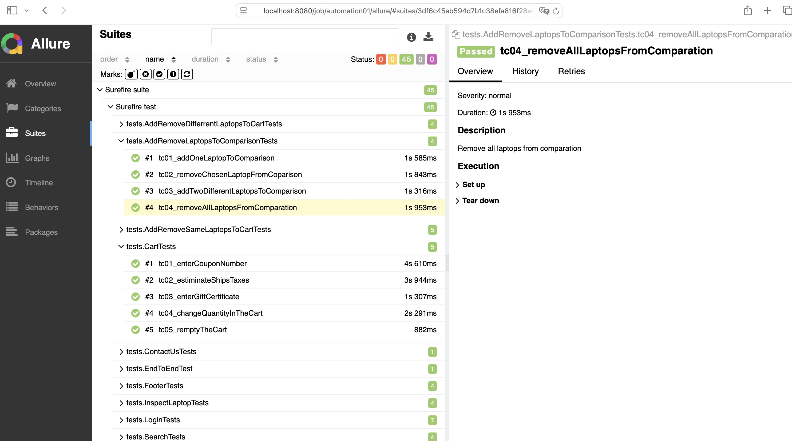

# 💻 My Automation Project 
### 🛠️ Testing Automation Demo Project for Tutorials Ninja Demo
This is a testing automation demo project that tests a real site called: http://tutorialsninja.com/demo/index.php.
It is designed as a practical example for learning modern test automation tools and techniques.
<p>
  
    
</p>

## 📑 Technologies & Skill & Features
| Technologies      | Description |
| ----------- | ----------- |
| **Java:**      | The project is developed using Java, providing a robust and widely used programming language for automation.       |
| **TestNG:**   | TestNG is used as the testing framework, offering powerful test configuration options, parallel execution, and detailed reporting.        |
| **Selenium WebDriver:**   | The project includes Selenium WebDriver for automating browser interactions        |
| **Page Object Model (POM):**   | The project follows the POM design pattern, enhancing test maintainability and reusability by separating page elements and actions.        |
| **Allure Reports:**   | Test results are documented using Allure Reports, providing a clear and interactive visualization of test execution.        |
| **Maven:**   | 	A build automation tool that simplifies dependency management, project builds, and test execution processes.
| **Jenkins:**   | Continuous integration and continuous delivery (CI/CD) platform for automated builds and deployments.        |

## 📊 Reports
  ```bash
  mvn allure:serve
  ```
## 📊 Reports Examples
<p>
  
  
</p>

## 📁 Project Structure
```
├── pom.xml
├── src/test
│   ├── java
│   │   ├── pageobjects
│   │   │   ├── BasePage.java
│   │   │   ├── CheckOutPage.java
│   │   │   ├── LaptopPage.java
│   │   │   ├── LaptopsAndNotebooksPage.java
│   │   │   ├── LoginPage.java
│   │   │   ├── MainPage.java
│   │   │   ├── MyCartPage.java
│   │   │   └── ProductComparisonPage.java
│   │   ├── tests
│   │   │   ├── AddRemoveDifferrentLaptopsToCartTests.java
│   │   │   ├── AddRemoveLaptopsToComparisonTests.java
│   │   │   ├── AddRemoveSameLaptopsToCartTests.java
│   │   │   ├── BaseTest.java
│   │   │   ├── CartTests.java
│   │   │   ├── ContactUsTests.java
│   │   │   ├── EndToEndTest.java
│   │   │   ├── FooterTests.java
│   │   │   ├── InspectLaptopTests.java
│   │   │   ├── LoginTests.java
│   │   │   ├── SearchTests.java
│   │   │   └── SortByTests.java
│   │   └── utils
│   │       └── Utils.java
│   └── resources
│       └── data
│           └── configuration.properties
└── testng.xml

```
Thanks for visiting my GitHub profile! 😊
Artyom Chernenko
